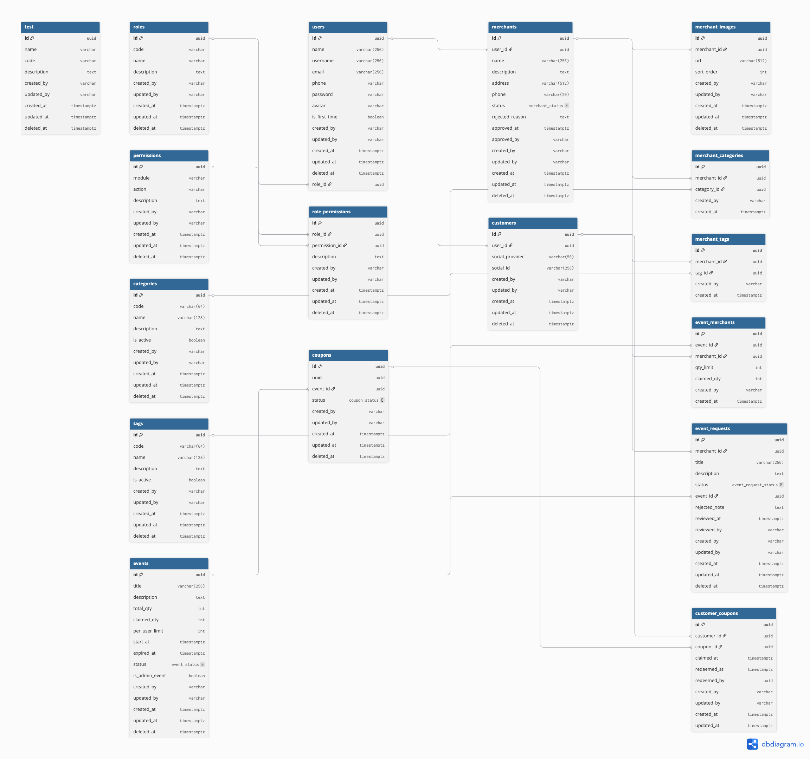

# cupons-api

Core API engine for Cupons apps.

## Use cases

[](./docs/images/use-cases.png)

## Schema

This application uses:

- PostgreSQL as primary database with [Prisma ORM](https://www.prisma.io/)
- Redis/ElastiCache for caching
- MINIO for storage

[](./docs/images/schema.png)

See the [DB Diagram](./docs/dbdiagram.md) to make changes at
[dbdiagram.io](https://dbdiagram.io/).

## Structure

See the [Development Principles](/docs/development-principles.md) doc
for more information.

| Module                                   | Description                                              |
| ---------------------------------------- | -------------------------------------------------------- |
| [common](./src/common)                   | Shared DTOs, filters, validators, and utilities.         |
| [config](./src/config)                   | Application configuration and env loading.               |
| [shared/health](./src/shared/health)     | Health checks and readiness endpoints.                   |
| [shared/prisma](./src/shared/prisma)     | Prisma service, helpers, and database access layer.      |
| [modules/auth](./src/modules/auth)       | Authentication flows, guards, and strategies.            |
| [modules/users](./src/modules/users)     | User management.                                         |
| [modules/roles](./src/modules/roles)     | Role definitions and assignments.                        |
| [modules/permissions](./src/modules/permissions) | RBAC permissions (module + action).               |
| [modules/tags](./src/modules/tags)       | Tag management.                                          |
| [modules/categories](./src/modules/categories) | Category management.                               |
| [modules/merchants](./src/modules/merchants) | Merchant registration, status, and profile data.    |
| [modules/events](./src/modules/events)   | Event management and event requests.                     |
| [modules/coupons](./src/modules/coupons) | Coupon issuance, status updates, and redemption.         |

## Quickstart (Docker)

```sh
# Install node modules
$ npm install

# Run docker containers for database, cache and etc
$ docker-compose up

# Generate and apply migrations for local development
$ npx prisma migrate dev

# Populate the database with mock data (optional)
$ npx prisma db seed

# Copy .env.example to .env, and add environment variables as needed
$ cp .env.example .env

# Run the app in watch mode
$ npm run start:dev
```

See the [Product & API Overview](/docs/docs.md) for more context on
roles, flows, and data models.

## Test

```sh
# Unit tests
$ npm run test

# E2E tests
$ npm run test:e2e

# Test coverage
$ npm run test:cov
```

## Status

Active.
